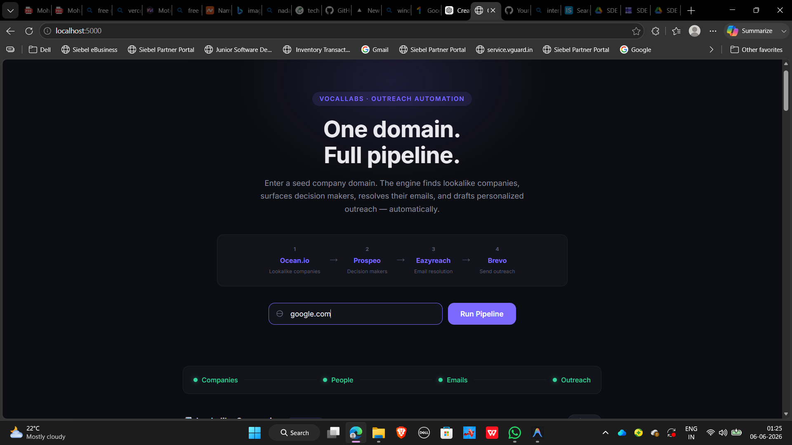
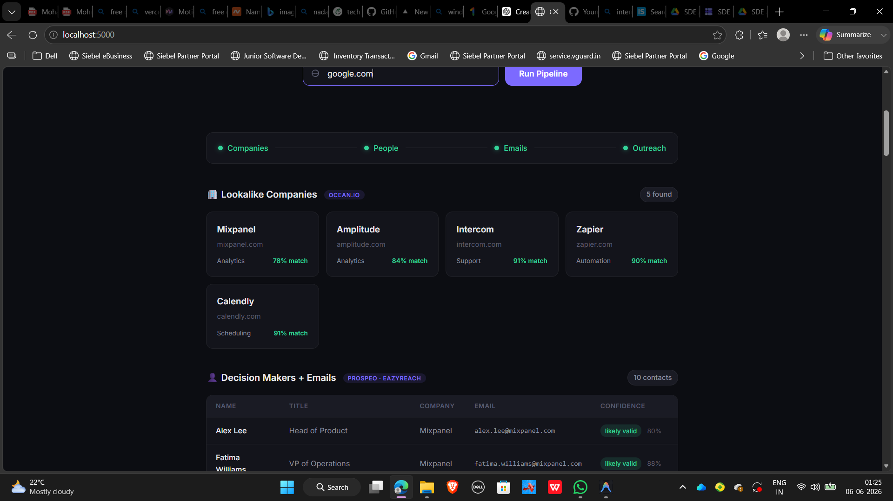
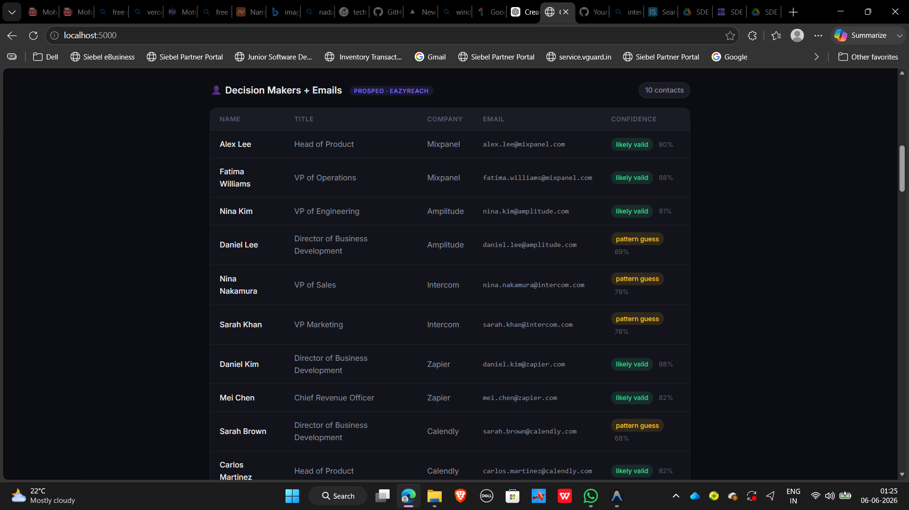
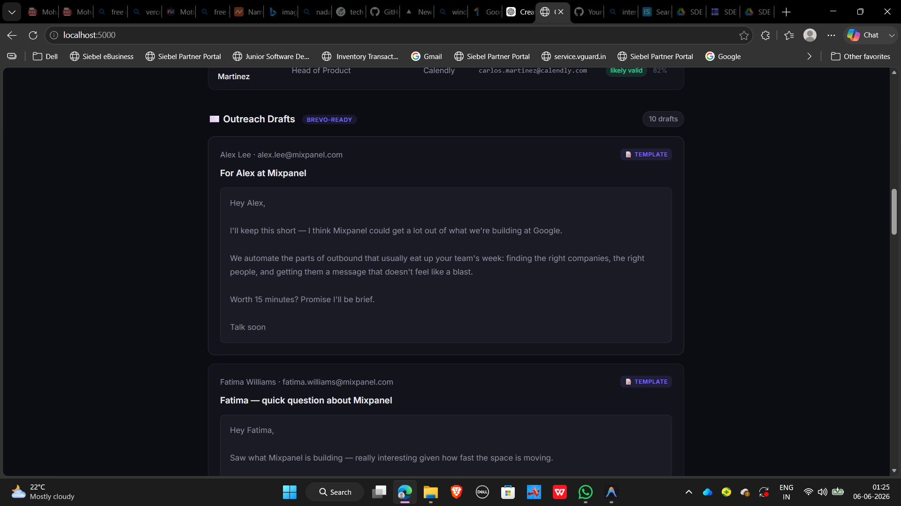

# Outreach Automation Engine

live demo link: www.outreachautomationengine.online

Note: Hosted on Render free tier. First load may take a few seconds while the server wakes up.

> **Vocallabs / Subspace — SDE Intern Assignment**  
> One domain in. Personalized outreach out. Zero manual steps between.

**Developer:** [Mohammed Sabeel](https://github.com/Mohammedsabeel063)  
**GitHub:** [github.com/Mohammedsabeel063/outreach-automation-engine](https://github.com/Mohammedsabeel063/outreach-automation-engine)

---

## What this does

A sales team normally spends 4–6 hours per outreach campaign doing this manually:

1. Google for companies similar to their best customers
2. Go on LinkedIn to find the right person at each company
3. Guess their email address and hope it works
4. Write a cold email that doesn't sound like a template

This pipeline does all four automatically — you enter a single domain, it figures out the rest.

```
python pipeline.py openai.com
```

---

## Screenshots

### Web UI — Hero + Input


### Pipeline running — Stage indicators active


### Results — Lookalike companies


### Results — Decision makers + verified emails


### Results — Personalized outreach drafts


### CLI — Full pipeline run


---

> Built by **Mohammed Sabeel** · [GitHub](https://github.com/Mohammedsabeel063) · SDE Intern Assignment @ Vocallabs

---

## The pipeline

```
[Input: seed domain]
       │
       ▼
[1] Ocean.io      — Finds 5 similar companies by firmographics and industry
       │
       ▼
[2] Prospeo       — Surfaces C-suite and VP-level contacts at each company
       │                with LinkedIn profile URLs
       ▼
[3] Prospeo       — Resolves each LinkedIn profile into a verified work email
       │
       ▼  ← SAFETY CHECKPOINT (review before sending)
       │
[4] Brevo         — Sends personalized outreach from your domain
```

Each stage feeds directly into the next. No copy-paste. No spreadsheets. No manual handoffs.

---

## Setup

### 1. Get a domain

Required for Brevo. Get one free via the [GitHub Student Developer Pack](https://education.github.com/pack) (Namecheap), or buy the cheapest `.me` domain — Vocallabs reimburses it.

### 2. Create accounts

Use your company email (`you@yourdomain.com`) to sign up:

| Tool | Sign up |
|---|---|
| Ocean.io | [ocean.io](https://ocean.io) |
| Prospeo | [app.prospeo.io](https://app.prospeo.io) |
| Brevo | [app.brevo.com](https://app.brevo.com) |

*Prospeo handles both decision maker search (Stage 2) and email resolution (Stage 3) using a single API key.*

### 3. Configure `.env`

```
OCEAN_API_KEY=your_key_here
PROSPEO_API_KEY=your_key_here
BREVO_API_KEY=your_key_here
SENDER_EMAIL=you@yourdomain.com
SENDER_NAME=Your Name

# optional — enables AI-generated email copy
OPENAI_API_KEY=your_key_here
```

### 4. Install and run

```bash
pip install -r requirements.txt

# CLI (primary)
python pipeline.py openai.com

# skip sending, just show the preview
python pipeline.py openai.com --dry-run

# web UI (bonus)
python app.py
# then open http://localhost:5000
```

---

## Why I built it this way

**Why Flask, not Django or FastAPI?**

This project needs exactly two things from a web layer: one page route and one JSON endpoint. Django would bring an ORM, migrations, and an admin panel — none of that applies here. FastAPI's async benefits don't matter at this volume. Flask gets out of the way and lets you focus on the actual pipeline logic.

**Why a separate file per service?**

`app.py` should only handle routing. If I put the Prospeo integration logic inside a Flask route, the first time I want to swap Prospeo for Apollo, I'm editing my HTTP layer — that's wrong. Each service file has one job: `prospeo_service.py` knows about finding people, nothing else. If you want to replace it, you change that one file and nothing else breaks.

**Why mock fallbacks?**

The pipeline should always run. During development, before API keys are set up, and during demos where you don't want to burn credits — mock data lets the entire flow execute with real-looking output. The mocks mirror the exact response shapes from the real APIs, so swapping in live calls is a 5-line change per service.

**Why a safety checkpoint?**

Cold emails sent to the wrong person, at the wrong time, from an unwarmed domain can permanently damage your sender reputation. The checkpoint exists so a human reviews the contact list before anything fires. The automation handles the research — humans handle the judgment call.

**What I'd add with more time:**

- Result persistence (SQLite) so you can revisit previous runs
- Job queue (Celery/RQ) for async pipeline execution
- Deduplication across multiple seed domains
- Email open/click tracking via Brevo webhooks
- Rate limiting per service to avoid burning free tier credits

---

## Project structure

```
├── pipeline.py              # Primary CLI — run this
├── app.py                   # Flask web UI wrapper
├── requirements.txt         # 4 dependencies
├── .env                     # API keys (not committed)
│
├── services/
│   ├── ocean_service.py     # Stage 1: lookalike companies
│   ├── prospeo_service.py   # Stage 2: decision makers
│   ├── prospeo_email_service.py # Stage 3: email resolution (Prospeo)
│   ├── outreach_generator.py # Email copy (AI or templates)
│   └── brevo_service.py     # Stage 4: send via Brevo
│
├── utils/
│   └── helpers.py           # Domain cleaning, validation
│
├── templates/
│   └── index.html           # Single-page web UI
│
└── static/
    ├── style.css            # Dark theme, glassmorphism
    └── app.js               # Staged pipeline animation
```

---

## Demo flow

```
$ python pipeline.py stripe.com --dry-run

  Outreach Automation Engine
  Seed domain: stripe.com
  -------------------------------------------------------

  [1/4] Finding lookalike companies  [Ocean.io]
  [OK]  Found 5 companies

  [2/4] Finding decision makers  [Prospeo]
  [OK]  Found 10 contacts

  [3/4] Resolving work email addresses  [Prospeo]
  [OK]  Resolved 10/10 email addresses

  Generating personalized outreach copy...
  [OK]  Generated 10 outreach emails

  SAFETY CHECKPOINT -- 10 emails queued
  [lists all recipients with company and title]

  Preview email for contact #1? [y/N]: y
  [shows email preview]

  [DRY RUN] Skipping actual send.
  Done! Pipeline complete for stripe.com
```
